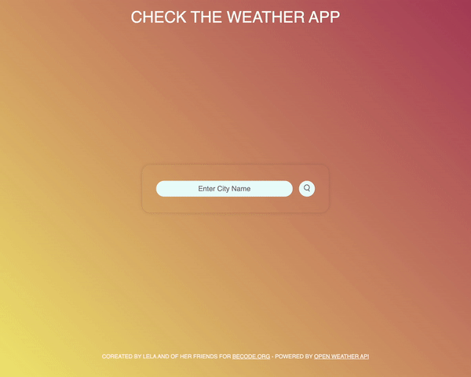

# My First Weather App

Welcome to "My First Weather App," a simple yet powerful weather forecasting application. This project was developed as a part of my journey in web development, with a focus on mastering essential skills in handling asynchronous requests, DOM manipulation, and data parsing.

## ⚙️ Technologies

  

## Learning objectives of this project

This project allowed me to achieve the following learning objectives:

- **AJAX Flow:** I implemented a typical AJAX flow, enabling the application to send asynchronous requests to a remote server and process the results seamlessly. This fundamental skill is crucial for real-time data retrieval.

- **DOM Manipulation:** Through DOM manipulation, I dynamically updated the web page based on the results of the AJAX requests. This skill is essential for creating interactive and responsive web applications.

- **Data Aggregation and Parsing:** I learned how to aggregate and parse data fetched from the OpenWeather API. This knowledge is fundamental for extracting relevant information from external data sources.-

## Sneak Peeks into the Weather App

## 🚀 Features:

- Users can select their desired city on the application's homepage, ensuring they receive weather forecasts for their chosen locations.
- With a simple click of the search button the app promptly retrieves the 5-day weather forecast for the selected city.
- To streamline the user experience, the app remembers the user's city choice for future visits.

## Project Status

This project was developed to fulfill specific learning objectives and served as an excellent introduction to working with AJAX, DOM manipulation, and data parsing.

However, it's worth noting that the application's responsiveness could be further improved to ensure a seamless experience across various devices and screen sizes.

Additionally, due to the use of a personal API key for authentication, the application is currently limited to personal use. The key is not publicly displayed to protect data security. So the application is not currently deployed.
